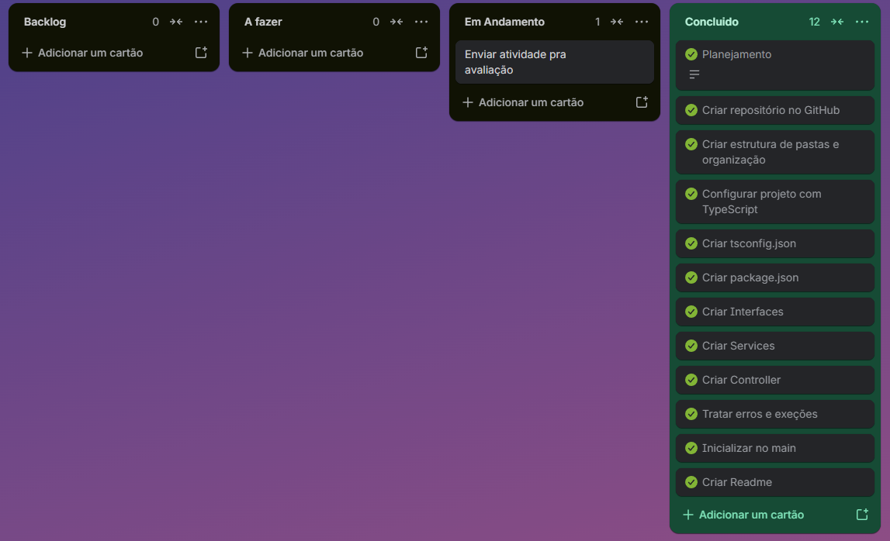

# Pokédex TypeScript Lite

## Sobre o projeto

O **Pokédex TypeScript Lite** é uma aplicação de back-end desenvolvida em **Node.js com TypeScript**, executada diretamente pelo terminal.

A aplicação permite consultar Pokémon através da **PokeAPI**, transformar os dados recebidos em um objeto simplificado e gerenciar um catálogo local de Pokémon.

Diferentemente de uma aplicação com interface gráfica ou API própria, o sistema utiliza um **menu interativo no terminal** para receber as entradas do usuário e apresentar os resultados.

## Objetivo

O projeto foi desenvolvido com o objetivo de praticar conceitos fundamentais de desenvolvimento back-end com Node.js e TypeScript, incluindo:

* Node.js
* TypeScript
* Tipagem estática
* Interfaces
* Classes
* Funções e métodos
* Arrays e objetos
* JSON
* fetch
* Promises
* async/await
* Tratamento de erros com try/catch
* Consumo de API externa
* Persistência de dados em arquivo JSON
* Arquitetura em camadas
* Git e GitFlow

---

## Tecnologias utilizadas

* Node.js
* TypeScript
* TSX 
* PokeAPI 
* Git
* GitHub

---

## Pré-requisitos

Antes de executar o projeto, é necessário possuir instalado:

* Node.js
* npm
* Git

---

## Como instalar

Clone o repositório:

```bash
git clone https://github.com/leonardorieg/Pokedex-TypeScript-Lite.git
```

Entre na pasta do projeto:

```bash
cd Pokedex-TypeScript-Lite
```

Instale as dependências:

```bash
npm install
```

---

## Como executar

Para executar o projeto em ambiente de desenvolvimento:

```bash
npm run start
```

A aplicação será iniciada diretamente no terminal.

---

## Menu da aplicação

Ao iniciar o programa, será apresentado o seguinte menu:

```text
POKÉDEX TYPESCRIPT LITE
----------------------
1 - Buscar Pokémon
2 - Adicionar Pokémon ao catálogo
3 - Remover Pokémon do catálogo
4 - Listar catálogo
0 - Sair
```

### 1 - Buscar Pokémon

Permite pesquisar um Pokémon através do seu **nome**.

Exemplo:

```text
Escolha uma opção: 1

Digite o nome do Pokémon: pikachu
```

A aplicação consulta a PokeAPI e retorna os dados simplificados:

```text
{
  id: 25,
  nome: "pikachu",
  tipos: ["electric"],
  altura: 4,
  peso: 60
}
```

A aplicação utiliza `fetch` com `async/await` para realizar a consulta à API.

---

### 2 - Adicionar Pokémon ao catálogo

A opção permite buscar um Pokémon na PokeAPI e adicioná-lo ao catálogo local.

Exemplo:

```text
Escolha uma opção: 2

Digite o nome do Pokémon: pikachu

[OK] - Pokemon adicionado
```

O sistema verifica se o Pokémon já está cadastrado antes de adicioná-lo.

Caso o Pokémon já exista:

```text
[ERRO] - Pokemon já existeno catálogo
```

---

### 3 - Remover Pokémon do catálogo

Permite remover um Pokémon através do seu ID ou nome.

Exemplo:

```text
Escolha uma opção: 3

Digite o nome ou o id pokemon que deseja remover: 25

[OK] - Pokemon removido
```

Também é possível utilizar o nome:

```text
Digite o nome ou o id pokemon que deseja remover: pikachu

[OK] - Pokemon removido
```

Caso o Pokémon não esteja no catálogo:

```text
[AVISO] - Pokemon não encontrado
```

---

### 4 - Listar catálogo

Exibe todos os Pokémon armazenados no catálogo.

Exemplo:

```text
Escolha uma opção: 4
```

Resultado:

```text
┌─────────┬────┬────────────┬────────────────┬────────┬──────┐
│ (index) │ id │ nome       │ tipos          │ altura │ peso │
├─────────┼────┼────────────┼────────────────┼────────┼──────┤
│    0    │ 25 │ 'pikachu'  │ [ 'electric' ] │   4    │  60  │
│    1    │ 6  │ 'charizard'│ [ 'fire', ...] │   17   │ 905  │
└─────────┴────┴────────────┴────────────────┴────────┴──────┘
```

Caso não existam Pokémon cadastrados:

```text
[AVISO] - Catálogo vazio
```

---

### 0 - Sair

Encerra o menu da aplicação:

```text
Saindo...
```

---

## Funcionalidades

* Buscar Pokémon na PokeAPI
* Buscar Pokémon pelo nome ou id
* Transformar a resposta da API em um objeto simplificado
* Exibir informações do Pokémon
* Adicionar Pokémon ao catálogo
* Impedir Pokémon duplicado
* Listar Pokémon cadastrados
* Remover Pokémon pelo ID
* Remover Pokémon pelo nome
* Persistir os dados em arquivo JSON
* Tratar Pokémon inexistente
* Exibir mensagens de erro e aviso no terminal
* Executar a aplicação através de menu interativo


---

## Arquitetura do projeto

O projeto utiliza uma arquitetura dividida em camadas, separando as responsabilidades da aplicação.

```text
Pokedex-TypeScript-Lite/
│
├── src/
│   ├── controllers/
│   │   └── terminalController.ts
│   │
│   ├── models/
│   │   └── pokemon.ts
│   │
│   ├── services/
│   │   ├── pokemonApiService.ts
│   │   └── boxService.ts
│   │
│   └── main.ts
│
├── pc_box.json
├── package.json
├── tsconfig.json
└── README.md
```

---

## Responsabilidade dos arquivos

### `main.ts`

É o ponto de entrada da aplicação.

Sua responsabilidade é criar as instâncias dos serviços e injetar no `TerminalController`.

```text
PokemonApiService
        ↓
BoxServices
        ↓
TerminalController
        ↓
executar()
```

Isso permite que o controller utilize os serviços sem precisar criar suas próprias dependências.

---

### `TerminalController.ts`

É responsável pela interação com o usuário através do terminal.

Suas responsabilidades incluem:

* Exibir o menu;
* Receber as opções do usuário;
* Solicitar dados;
* Chamar os serviços necessários;
* Exibir os resultados;
* Tratar erros apresentados pelos serviços.

O controller funciona como uma camada de interface e orquestração do fluxo da aplicação.

---

### `pokemon.ts`

Contém as interfaces utilizadas para tipar os dados relacionados aos Pokémon.

#### `PokemonResumo`

Representa o objeto simplificado utilizado internamente pela aplicação:

```typescript
export interface PokemonResumo {
    id: number;
    nome: string;
    tipos: string[];
    altura: number;
    peso: number;
}
```

#### `PokemonApiResponse`

Representa a estrutura dos dados recebidos da PokeAPI que são necessários para o projeto.

O uso de uma interface para representar a resposta da API está de acordo com o requisito do projeto de tipar apenas os campos utilizados pela aplicação.

---

### `pokemonApiService.ts`

É responsável pela comunicação com a PokeAPI.

Utiliza:

* fetch
* async/await
* Promise
* Interfaces TypeScript
* Tratamento de resposta HTTP

A URL utilizada é:

```text
https://pokeapi.co/api/v2/pokemon/{nome-ou-id}
```

A PokeAPI disponibiliza consultas por nome ou ID.

Depois da resposta, os dados são transformados em um `PokemonResumo`.

Exemplo:

```typescript
const PokemonResumo: PokemonResumo = {
    id: dados.id,
    nome: dados.species.name,
    tipos: dados.types.map(tipo => tipo.type.name),
    altura: dados.height,
    peso: dados.weight
}
```

---

### `boxService.ts`

É responsável pelo gerenciamento do catálogo local.

Utiliza:

```typescript
node:fs/promises
```

para ler e escrever os dados no arquivo:

```text
pc_box.json
```

Principais métodos:

```text
adicionar()
buscarTodos()
buscarPorIdOuNome()
remover()
```

Também aplica as regras relacionadas ao catálogo, como:

* impedir duplicidade;
* localizar Pokémon;
* remover Pokémon;
* atualizar o arquivo JSON.

---

### `pc_box.json`

Funciona como a persistência local da aplicação.

Exemplo:

```json
[
  {
    "id": 25,
    "nome": "pikachu",
    "tipos": [
      "electric"
    ],
    "altura": 4,
    "peso": 60
  }
]
```

O arquivo permite que os Pokémon adicionados permaneçam armazenados mesmo após o encerramento do programa.

---

## Métodos de array utilizados

O projeto utiliza diversos métodos de array.

### `map()`

Utilizado para transformar os tipos retornados pela API:

```typescript
dados.types.map(tipo => tipo.type.name)
```

Transforma a estrutura recebida pela API em:

```text
["electric"]
```

### `some()`

Utilizado para verificar se o Pokémon já existe no catálogo:

```typescript
pokemons.some(item => item.id === pokemon.id)
```

### `find()`

Utilizado para localizar um Pokémon pelo ID ou nome:

```typescript
pokemons.find(pokemon => {
    return pokemon[propriedade] === idOuNome;
})
```

### `filter()`

Utilizado para remover o Pokémon do catálogo:

```typescript
pokemons.filter(item => {
    return item.id !== pokemon.id;
})
```

O projeto utiliza, portanto, mais de três métodos de array, atendendo ao requisito de uso de métodos como `map`, `filter`, `find` e `some`.

---

## Tratamento de erros

A aplicação utiliza `try/catch` para evitar que erros durante a execução interrompam o programa.

Exemplo:

```typescript
try {
    res = await this.buscaNaApi(rl);
} catch (erro) {
    if (erro instanceof Error) {
        console.log(erro.message);
    }
}
```

Quando um Pokémon inexistente é pesquisado, a aplicação identifica que a resposta da API não foi bem-sucedida e apresenta uma mensagem de erro.

O tratamento de Pokémon inexistente é um requisito funcional do projeto.

---

## Exemplos de execução

### Busca válida

**Entrada:**

```text
Escolha uma opção: 1

Digite o nome do Pokémon: pikachu
```

**Resultado:**

```text
{
  id: 25,
  nome: 'pikachu',
  tipos: [ 'electric' ],
  altura: 4,
  peso: 60
}
```

---

### Busca inválida

**Entrada:**

```text
Escolha uma opção: 1

Digite o nome do Pokémon: pokemon-inexistente
```

**Resultado:**

```text
[ERRO] - Pokemon não encontrado: pokemon-inexistente
```

---

### Adicionando Pokémon

**Entrada:**

```text
Escolha uma opção: 2

Digite o nome do Pokémon: pikachu
```

**Resultado:**

```text
[OK] - Pokemon adicionado
```

---

### Tentativa de duplicidade

**Entrada:**

```text
Escolha uma opção: 2

Digite o nome do Pokémon: pikachu
```

**Resultado:**

```text
[ERRO] - Pokemon já existeno catálogo
```

---

### Listando catálogo

**Entrada:**

```text
Escolha uma opção: 4
```

**Resultado:**

A aplicação apresenta os Pokémon armazenados através do `console.table()`.

```
┌─────────┬────┬──────────────┬──────────────────────┬────────┬──────┐
│ (index) │ id │ nome         │ tipos                │ altura │ peso │
├─────────┼────┼──────────────┼──────────────────────┼────────┼──────┤
│ 0       │ 4  │ 'charmander' │ [ 'fire' ]           │ 6      │ 85   │
│ 1       │ 5  │ 'charmeleon' │ [ 'fire' ]           │ 11     │ 190  │
│ 2       │ 6  │ 'charizard'  │ [ 'fire', 'flying' ] │ 17     │ 905  │
│ 3       │ 25 │ 'pikachu'    │ [ 'electric' ]       │ 4      │ 60   │
│ 4       │ 7  │ 'squirtle'   │ [ 'water' ]          │ 5      │ 90   │
└─────────┴────┴──────────────┴──────────────────────┴────────┴──────┘
```
---
### Removendo Pokémon

**Entrada:**

```text
Escolha uma opção: 3

Digite o nome ou o id pokemon que deseja remover: 25
```

**Resultado:**

```text
[OK] - Pokemon removido
```

---

## Conceitos aplicados

### TypeScript

O TypeScript é utilizado em toda a aplicação para fornecer tipagem estática aos dados, parâmetros e retornos das funções.

Exemplo:

```typescript
async buscaPokemon(
    idOuNome: string
): Promise<PokemonResumo | null>
```

---

### Interfaces

A interface `PokemonResumo` define o formato dos dados simplificados utilizados pela aplicação.

```typescript
export interface PokemonResumo {
    id: number;
    nome: string;
    tipos: string[];
    altura: number;
    peso: number;
}
```

---

### Classes

A aplicação utiliza classes para organizar os serviços e o controller:

```text
TerminalController
BoxServices
PokemonApiService
```

---

### Async/Await

Utilizado para trabalhar com operações assíncronas, principalmente:

* consultas à PokeAPI;
* leitura do arquivo JSON;
* escrita do arquivo JSON.

---

### Promises

Os métodos assíncronos retornam Promise, permitindo controlar operações que dependem de entrada/saída ou comunicação externa.

---

### JSON

O JSON é utilizado tanto na comunicação com a PokeAPI quanto na persistência local do catálogo.

---


## Kanban

Link do Kanban:



---

## Branches utilizadas

```text
main
develop
feat/pokemon-model
feat/pokemon-service
feat/pokemon-controller
fix/mensagem-erro
docs/readme
```

---

## Melhorias futuras

Algumas melhorias que podem ser implementadas futuramente:

* Melhorar a formatação das informações exibidas;
* Exibir HP, ataque e defesa;
* Criar filtros por tipo;
* Criar opção para limpar o catálogo;
* Criar validações mais específicas para entradas do usuário;
* Criar classes de erros customizadas;
* Criar testes automatizados;
* Criar uma API própria utilizando Express;
* Adicionar uma interface web para consumir a aplicação.

---

## Autor

**Leonardo Floriano Rieg**

